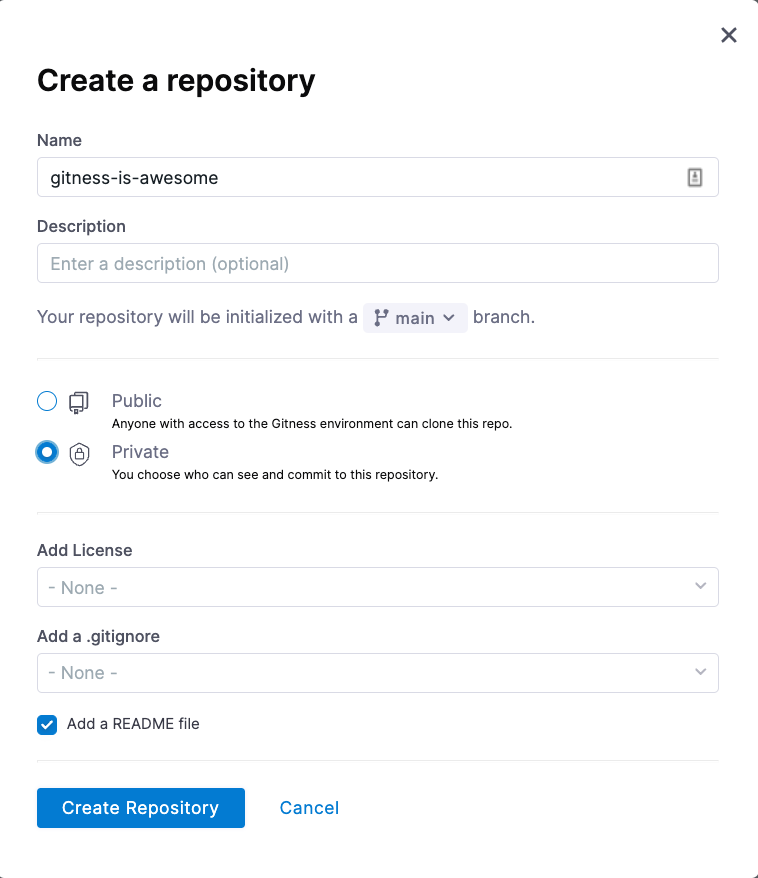

# Gitness Workshop

## Prerequisites

- [Docker installation](https://docs.docker.com/engine/install/) (tested with Docker Desktop 4.26.1 and docker CLI 24.0.7)
- [k3d](https://k3d.io/) installed (tested with 5.6.3)
- [kubectl](https://kubernetes.io/docs/reference/kubectl/) installed (tested with 1.28.2)
- (Optional) A slack workspace with admin access to create a webhook for notifications.

## Get Started

### Create a Docker Network

Create a common network for Gitness and the local Kubernetes cluster. This allows Gitness pipeline containers to communicate with the cluster.

```shell
docker network create gitness
docker network ls
```

### Create a local Docker registry

Create a k3d Docker registry to contain the built Docker image for deployment.

```shell
k3d registry create registry.localhost --port 5000
```

### Start Gitness

1. Use the following Docker command to run Gitness (observe the network this container uses):

```shell
docker run -d \
  -e GITNESS_PRINCIPAL_ADMIN_EMAIL=admin@example.com \
  -e GITNESS_PRINCIPAL_ADMIN_PASSWORD=adminpass1 \
  -e GITNESS_USER_SIGNUP_ENABLED=true \
  -e GITNESS_CI_CONTAINER_NETWORKS=gitness \
  -p 3000:3000 \
  -v /var/run/docker.sock:/var/run/docker.sock \
  -v /tmp/gitness:/data \
  --network=gitness \
  --name gitness \
  --restart always \
  harness/gitness
```
2. Once the container is running, open `localhost:3000` in your browser.
3. Select **Sign Up**.
4. Enter a User ID (`developer`), Email (`developer@example.com`), and Password (`devpass1`).
5. Select **Sign Up**. (You might see a warning to change your password. You can ignore that warning.)
6. Log out from the developer account. Click the profile icon from the bottom-left corner and then click **Log out**. 
7. Log in using the admin User ID (`admin`) and Password (`adminpass1`). 

### Create a new Project

1. Select **New Project**.
2. Enter a project Name (devdays) and optional Description (Gitness is awesome).
3. Select **Create Project**.

Optionally, Gitness can [import projects](https://docs.gitness.com/administration/project-management#import-a-project) from external sources (such as GitLab groups or GitHub organizations).

### Create and configure a local Kubernetes Cluster

Create a k3d cluster, passing the Docker network, a specific API port, and a Docker registry.

```shell
k3d cluster create --network gitness --api-port 9090 --registry-use k3d-registry.localhost:5000 devdays
kubectl cluster-info
```

Create the gitness namespace.

```shell
kubectl create namespace gitness
```

Download the [service account manifest file](service-account.yml).

```shell
curl -sLO https://raw.githubusercontent.com/harness-community/gitness-lab/main/service-account.yml
ls service-account.yml
```

Apply the service account manifest.

```shell
kubectl apply -f service-account.yml
```

Get the service account token.

```shell
kubectl get secret gitness-sa-token -n gitness -o=jsonpath='{.data.token}' | base64 -d && echo
```

Save this token. You’ll use this later.

<details>
  <summary>(Optional) Create a Slack Webhook</summary>

This step is optional and is used to demonstrate how to send notifications from your Gitness pipeline. If you don’t have a Slack workspace set up already, you can skip this step.

<ol>
    <li> Once you have signed in to your Slack workspace, navigate to https://YOUR_SLACK_WORKSPACE_NAME.slack.com/apps and search for <b>Incoming WebHooks</b> under the apps.
    <li> Click <b>Add to Slack</b> and either choose an existing channel or create a new one where the notifications will be sent.
    <li>Click <b>Add Incoming Webhook Integration</b>.
    <li>Copy the Webhook URL under Setup Instructions. You’ll use this later.
</ol>

</details>

## Code Repo

### Create a Repository

1. In your project, select **Repositories**, and then select **New Repository**.
2. Enter a repository **Name** and optional **Description**. Let’s use `gitness-is-awesome` for the repository name.
3. Gitness repositories are initialized with a main branch, unless you specify a different name for the base branch. To change the base branch name, select main and enter a name for the base branch.
4. Select your preference for visibility (**Public** or **Private**). Let’s keep the visibility **Private** for this example. 
5. Optionally, you can add a License, .gitignore, or README file to your repository. Check the box **Add a README file**.
6. Select **Create Repository**.



Once the repository is created, click **+ New File**, give the file a name **app.py**, and paste the following:

```python
# app.py

def main():
    print("Gitness is awesome!")

if __name__ == "__main__":
    main()
```

7. Click **Commit Changes** and then **Commit**.

This is how you can create a new repository in Gitness. In the next section, you’ll import a repository from GitHub.